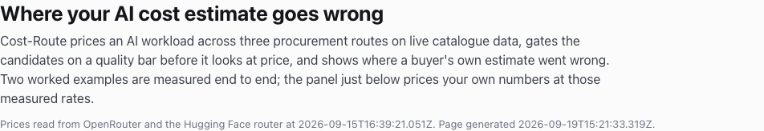
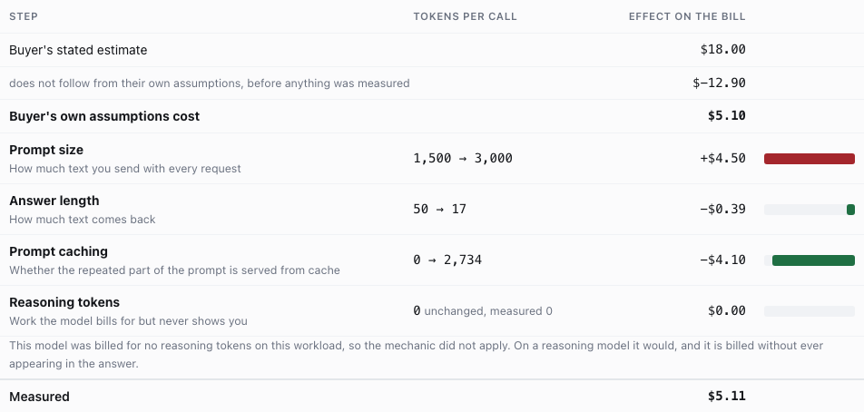
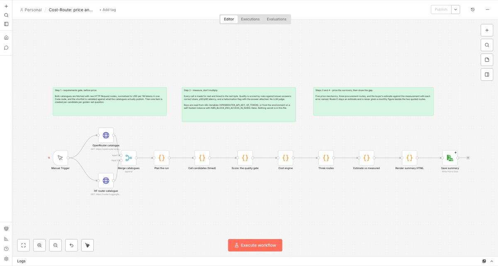

# Hi, I'm Madeline 👋

📍 Berlin | Partnerships & business development in AI infrastructure | 🤖 Building in public

I've spent 10+ years building revenue-driving partnerships and ecosystems across blockchain
infrastructure, fintech and software — usually as the first partnerships hire, building the
programme from zero. Lately I've been on the other side of the table: shipping AI tooling in
public, with the API keys, the invoices and the 2am debugging that come with it.

## ⭐ Featured project: Cost-Route

**[Read the live report →](https://therealmaddieli.github.io/cost-route/)** ·
**[Source →](https://github.com/therealmaddieli/cost-route)**

One self-contained HTML page that prices the same AI workload across three procurement routes —
closed API, open weights served by a third party, and open weights self-hosted — and shows where
the buyer's own estimate went wrong. Every measured figure comes from calls that were actually
made and billed. Measurements and assumptions are labelled separately, and the two are never mixed.

**Why it is not a cost calculator.** A model that fabricates a contract clause is not the cheap
option, so Cost-Route applies the buyer's quality bar *before* it looks at price. It then prices
the survivors across five mechanics — base rate, cached input, tiered rates, reasoning tokens and
per-call charges — compares the routes on the things a price cannot express (licences, gating,
provider fallback, operations), and closes with the gap between the estimate and the measurement,
with every error named and priced.

**What it found, on real calls:**

- **Legal contract review:** the buyer estimated **$18/month**. Their own stated assumptions priced
  to **$5.10**. The measured calls cost **$5.11**. The first gap is arithmetic; only the second one
  is a measurement problem, and only the second one would have been caught by measuring anything.
- **The quality gate separated the shortlist:** GPT-5 mini passed 14/14; GPT-4o mini failed at
  12/14 with one fabricated answer — cheaper per call, and unusable for the task.
- **Image generation:** the same one-sentence prompt cost **238× more prompt tokens** on one model
  than another, while the bills landed within **4%** of each other and latency differed **5.9×**.
  Three metrics, three different winners, and no price list shows any of it.

**Built with:** a twelve-node **n8n** workflow — raw HTTP Request nodes for every catalogue and
model call, Code nodes for unit normalisation, rule-based scoring, the cost engine and the ledger
— and **Claude Code** as the agentic coding tool. 318 tests, MIT licensed, and the report is one
HTML file that needs no server and no API key to read.

## Other things I've built

- 🤖 **[AI Digital Twin](https://github.com/therealmaddieli/digital-twin)** — deployed on AWS with Terraform
- 🎫 **[Ticketmaster Demo](https://github.com/therealmaddieli/ticketmaster)** — search, filters and data fetching
- 🌐 **[Portfolio](https://therealmaddieli.github.io/portfolio/)** — the site I keep iterating on

## What I Care About

- Making the economics of AI legible to the people who have to sign off on them
- Social issues and privacy
- Making fintech accessible
- Kind, curious communities

## Connect

- GitHub: https://github.com/therealmaddieli
- LinkedIn: https://www.linkedin.com/in/madelineshuhui-li
- Cost-Route: https://therealmaddieli.github.io/cost-route/
- Portfolio: https://therealmaddieli.github.io/portfolio/

Open to opportunities in AI, fintech, and PM experience.

## Philosophy

> Ship beats perfect. I'm learning in public and iterating toward useful, delightful outcomes.
